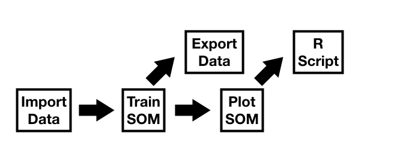

aweSOM
------

**aweSOM** is an R package offering a set of tools to explore and
analyze datasets with Self-Organizing Maps (also known as [Kohonen
maps](https://en.wikipedia.org/wiki/Self-organizing_map)), a form of
artificial neural network originally created by [Teuvo
Kohonen](https://en.wikipedia.org/wiki/Teuvo_Kohonen) in the 1980s. The
package introduces interactive plots, making analysis of the SOM easier.

**aweSOM** provides a variety of functions to analyze and visualize
SOMs:

* initialize and train SOMs, on numeric and categorical data
* plot interactive visualizations of SOM: map information, numeric variables, categorical variables
* export interactive SOM visualizations as a standalone HTML file, or as a static svg file
* compute and evaluate super-classes on the SOM prototypes, using hierarchical or PAM clustering
* generate reproducible R code using the web-based interface.

These can be used either through the web-based interface (called by
`aweSOM()`) or through command-line functions. The package relies on the
`kohonen` package for the training of SOMs.

While standard SOM works on numeric data only, aweSOM handles **categorical variables** through dummy-encoding and appropriate scaling (as in MCA). As in **specific** MCA, chosen levels can be dropped from the training data. **Mixed data** are also supported, with a treatment equivalent to FAMD (factorial analysis of mixed data).

### Install

Install the package from CRAN:

    install.packages("aweSOM")

### aweSOM web-based interface

An intuitive and user-friendly approach to training and analyzing
datasets with self-organizing maps is enabled by the aweSOM web-based
interface. It allows the user to import data, train a SOM, analyze via
the interactive visualizations and download results. Plots can be exported 
as interactive versions (HTML format), or static image files (.svg).
Additionally, it creates replicable R-code to perform the operations 
using command-line functions of **aweSOM**.

The web-based interface can be launched using the following function.

    aweSOM()

### aweSOM command-line functions

The aweSOM package provides command-line functions that enable functionality similar to the web-based interface. 

Detailed documentation of the command-line functions and their usage within a typical workflow is described [here](articles/aweSOM.html).

    

